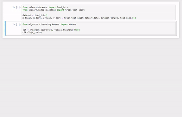
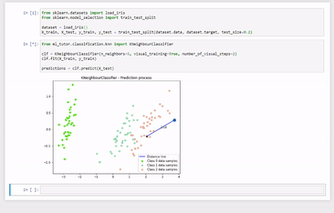
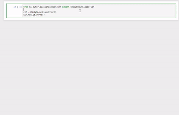
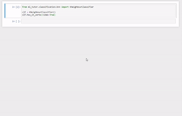
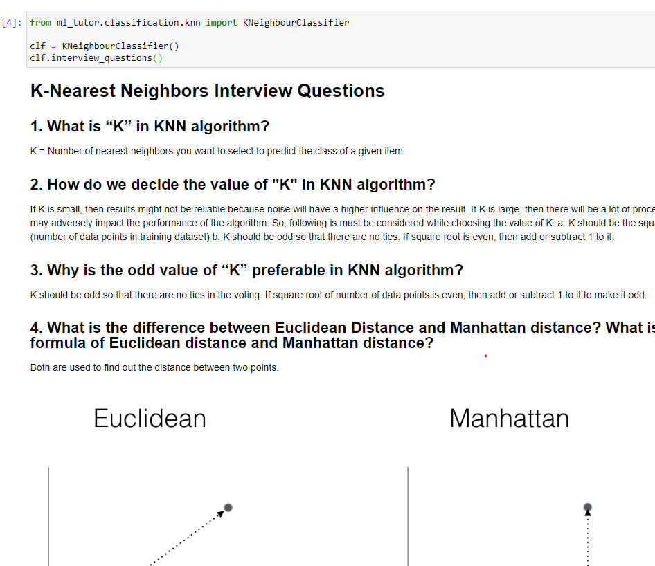
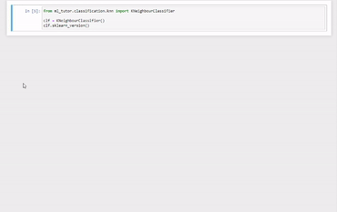

# ML Tutor v1.0.1

ML Tutor is a Python library created to help people learn Machine Learning (ML). 

Machine Learning (ML) is pretty hard and especially if you are just starting (been there done that)! 
I've created this library to help anybody interested in learning ML. ML Tutor provides visual training 
for every algorithm inside it so you can visualize what's happening with your data in real-time!
Besides that, for every algorithm, there is a theory on how it works and interview questions. 

Happy learning! ^_^

Use ML Tutor if you are looking to:

- Learn most popular Machine Learning algorithms directly from Jupyter Notebook or Google Colab
- Visualize what's happening with your data (Educational purpose only)


## Usage

To demonstrate what you can do with ML Tutor, we will need a dataset.
You can use your own dataset or some classic dataset (such as [Iris](https://archive.ics.uci.edu/ml/datasets/iris)).

Let's use the Iris dataset from the Sklearn library and split it into the training and testing subsets.

```python
from sklearn.datasets import load_iris
from sklearn.model_selection import train_test_split

dataset = load_iris()
X_train, X_test, y_train, y_test = train_test_split(dataset.data, dataset.target, test_size=0.2)
```

### Training/Prediction

#### Clustering
For the clustering example, let's import KMeans and demonstrate how to use it with the ML Tutor library.
Notice that you can train/test it just like any `sklearn` algorithm.

Each algorithm has several arguments you can provide, but the unique one across all of them is `visual_training`. 
If you set this to `True`, you will see the whole training process inside your IDE.

```python
from ml_tutor.clustering.kmeans import KMeans

clf = KMeans(n_clusters=3, visual_training=True)
clf.fit(X_train)
```


#### Classification

For the classification example, let's use KNeighbourClassifier (KNN).

Because the KNN just stores data when you call the `.fit()` function on it, the visualization part comes in the __prediction__ time.

```python
from ml_tutor.classification.knn import KNeighbourClassifier

clf = KNeighbourClassifier(n_neighbors=5, visual_training=True, number_of_visual_steps=2)
clf.fit(X_train, y_train)

predictions = clf.predict(X_test)
```



### How an algorithm works? (theory)

Every algorithm has method `.how_it_works()` which generates a blog post directly inside your IDE.
Every blog is written by somebody from the community, not myself, and in the end, they get a shout out for the great material.
```python
from ml_tutor.classification.knn import KNeighbourClassifier

clf = KNeighbourClassifier()
clf.how_it_works()
```



#### What if I prefer video instead of reading tutorial?

I've got you covered! Just place `video=True` inside the method `how_it_works()`, and it will open a YouTube video for you.

```python
from ml_tutor.classification.knn import KNeighbourClassifier

clf = KNeighbourClassifier()
clf.how_it_works(video=True)
```




### Interview questions

If you call `.interview_questions()` on any algorithm, it will generate resources with interview questions for the algorithm.

```python
from ml_tutor.classification.knn import KNeighbourClassifier

clf = KNeighbourClassifier()
clf.interview_questions()
```



### Sklearn code

Since this is the library for education and not for production, you'll need to learn how to use these algorithms with the battle-tested library `sklearn`. Just call `.sklearn_version()` on any algorithm, and it will generate code for you!

NOTE: For now, this method only works in Jupyter Notebook!

```python
from ml_tutor.classification.knn import KNeighbourClassifier

clf = KNeighbourClassifier()
clf.sklearn_version()
```



## Supported IDEs

For now this library is fully supported for `Jupyter Notebook` and partially supported for `Google Colab` 
(read `Sklearn code` section for more details). 

## Installation

### Installation with `pip`

You can install ML Tutor directly from the PyPi repository using `pip` (or `pip3`): 

```bash
pip install ml-tutor
```

### Manual installation

If you prefer to install it from source:

1. Clone this repository

```bash
git clone https://github.com/lucko515/ml-tutor
```

2. Go to the library folder and run

```bash
pip install .
```

## TODO

If you want to contribute to the ML Tutor, here is what's on the TODO list:

- [ ] `.sklearn_version()` is not working in Google Colab
- [ ] Logistic Regression visualization needs a re-do, currently it's not showing how the classification lines moves over time
- [ ] Interview questions should be added to each algorithm (take the `knn.py` as a reference)
- [ ] Visualization export to `.gif` and/or `.mp4`
- [ ] Additional algorithms (e.g. NaiveBayes)
- [ ] Support for other IDEs (e.g. regular Python Shell)

## Contact

Add me on [LinkedIn](https://www.linkedin.com/in/luka-anicin/).


